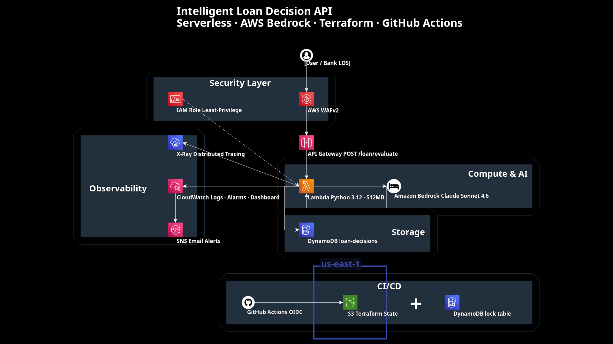

# Intelligent Loan Decision API

> A serverless, AI-powered loan pre-screening API built on AWS. Uses Claude Sonnet 4.6 via Amazon Bedrock to evaluate loan applications with explainable risk reasoning — fully provisioned with Terraform and deployed via GitHub Actions CI/CD.

---

## Architecture



**AWS Services Used:**
- **WAFv2** — SQLi/XSS protection + IP rate limiting (100 req / 5 min)
- **API Gateway** — REST API with API key auth, throttling, X-Ray tracing
- **Lambda** — Stateless evaluator function (Python 3.12, 512MB)
- **Amazon Bedrock** — Claude Sonnet 4.6 via cross-region inference profile
- **DynamoDB** — Immutable audit trail with GSI for compliance queries
- **CloudWatch** — Structured logs, 4 alarms, operational dashboard
- **X-Ray** — Distributed tracing across API Gateway → Lambda → Bedrock
- **SNS** — Email alerts on alarm breach
- **IAM** — Least-privilege role scoped to specific model ARN and table
- **S3 + DynamoDB** — Terraform remote state + state locking
- **GitHub Actions** — OIDC keyless CI/CD (no stored AWS credentials)

---

## Why This Architecture

This is a **regulated financial services pattern**. Design decisions were intentional:

| Decision | Reason |
|---|---|
| API Key auth | Simulates internal service auth in a banking environment |
| DynamoDB audit log | Regulatory requirement — every decision must be traceable |
| Throttle: 5 req/sec | Loan evaluation is not a high-frequency operation; prevents abuse |
| Bedrock over direct API | Keeps data inside AWS boundary — critical for financial data compliance |
| PAY_PER_REQUEST DynamoDB | Unpredictable traffic pattern for loan submissions |
| X-Ray tracing | Latency debugging across the async Bedrock call chain |
| OIDC keyless CI/CD | No long-lived AWS credentials stored anywhere |
| WAFv2 managed rules | SQLi, XSS, known exploits blocked at the edge before Lambda is invoked |

---

## Request / Response

### POST `/loan/evaluate`

**Headers:**
```
Content-Type: application/json
x-api-key: <your-api-key>
```

**Request Body:**
```json
{
  "applicant": {
    "name": "Jane Smith",
    "annual_income": 85000,
    "monthly_debt": 800,
    "employment_years": 5,
    "credit_history": "Good standing, no defaults, 2 credit cards paid on time",
    "notes": "Stable government employment"
  },
  "loan": {
    "amount": 25000,
    "term_months": 60,
    "purpose": "Home renovation"
  }
}
```

**Response:**
```json
{
  "request_id": "f3a2b1c0-...",
  "timestamp": "2026-04-20T14:32:00Z",
  "decision": "APPROVE",
  "risk_score": 18,
  "confidence": "HIGH",
  "reasoning": "Applicant demonstrates stable income with a DTI of 22% including the proposed loan, well within acceptable range. Five years of continuous employment and clean credit history support approval.",
  "risk_factors": ["Self-reported credit history only"],
  "recommended_conditions": ["Verify employment with recent pay stubs"]
}
```

**Decision values:** `APPROVE` | `DENY` | `REVIEW`

---

## Getting Started

### Prerequisites

- AWS CLI configured (`aws configure`)
- Terraform >= 1.5
- Python 3.12
- GitHub account

### Deploy

```bash
# 1. Clone the repo
git clone https://github.com/RohithBalijepalli/loan-decision-api
cd loan-decision-api

# 2. Run the one-time bootstrap (creates OIDC role + S3 state bucket)
bash scripts/bootstrap-oidc.sh

# 3. Add GitHub Secrets (output printed by bootstrap script)
#    AWS_ROLE_ARN, TF_STATE_BUCKET, TF_LOCK_TABLE

# 4. Push to development branch — pipeline deploys automatically
git push origin development
```

See [docs/EXECUTION_GUIDE.md](docs/EXECUTION_GUIDE.md) for the full step-by-step guide.

---

## Project Structure

```
loan-decision-api/
├── .github/
│   └── workflows/
│       └── deploy.yml             # CI/CD — 5 jobs: test, lint, plan, deploy-dev, deploy-prod
├── scripts/
│   └── bootstrap-oidc.sh          # One-time AWS OIDC + state bucket setup
├── src/
│   └── lambda/
│       └── handler.py             # Core evaluation logic (validate → DTI → Bedrock → DynamoDB)
│   └── tests/
│       └── test_handler.py        # Unit tests (pytest + moto)
├── terraform/
│   ├── main.tf                    # Root module
│   ├── variables.tf
│   ├── outputs.tf
│   └── modules/
│       ├── api_gateway/           # REST API + throttling + API key + CloudWatch logging
│       ├── lambda/                # Function + CloudWatch alarm + X-Ray
│       ├── bedrock_iam/           # Least-privilege IAM role (scoped to model ARN)
│       ├── dynamodb/              # Audit table + GSI + TTL + encryption + PITR
│       ├── monitoring/            # SNS + 4 CloudWatch alarms + dashboard
│       └── waf/                   # WAFv2 — managed rules + rate limiting
└── docs/
    ├── ARCHITECTURE.md            # Full real-world architecture explanation
    ├── EXECUTION_GUIDE.md         # Step-by-step deploy + test guide
    ├── architecture.png           # Architecture diagram
    └── test_payloads.json         # 3 test cases: approve, deny, review
```

---

## What I Learned / Engineering Notes

- **Bedrock inference profiles**: Claude 4.x models require cross-region inference profile IDs (`us.anthropic.claude-sonnet-4-6`), not bare model IDs — and IAM must allow both the inference profile ARN and the underlying foundation model ARN
- **Bedrock response parsing**: Claude returns clean JSON when the system prompt is strict, but defensive parsing is still necessary for edge cases
- **DTI calculation**: Estimated monthly payment (amount / term) is included in DTI — same approach real underwriters use
- **Audit trail design**: Using `request_id` as DynamoDB hash key with `decision` GSI allows querying all denials — useful for fair lending bias auditing
- **IAM scoping**: Bedrock invoke permission is scoped to the specific model ARN, not `bedrock:*` — principle of least privilege matters in financial contexts
- **API Gateway CloudWatch logging**: Requires an account-level IAM role set via `aws_api_gateway_account` before stage logging can be enabled

---

## Cleanup

```bash
cd terraform
terraform destroy -var="environment=dev"
```

---

## Author

**Rohit Balijepalli** — Software Engineer
AWS Certified Solutions Architect | Popular Bank
[LinkedIn](https://www.linkedin.com/in/rohit-balijepalli) · [GitHub](https://github.com/RohithBalijepalli)
